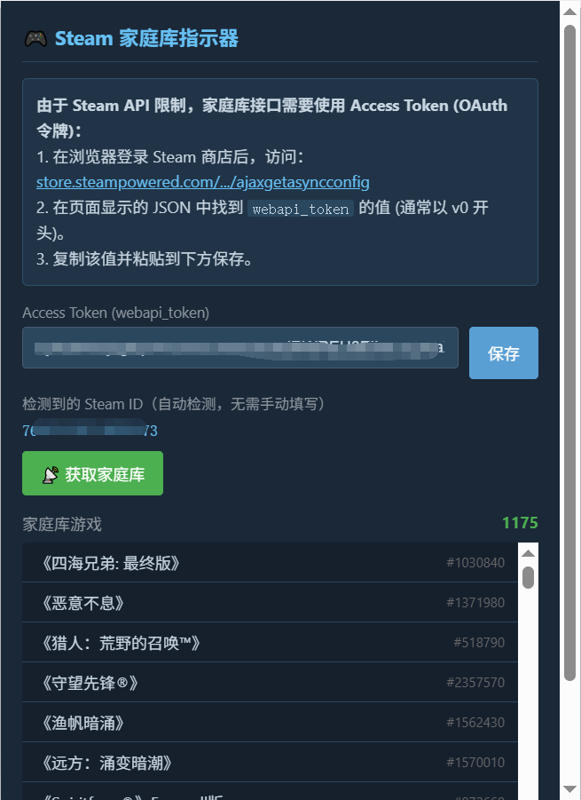
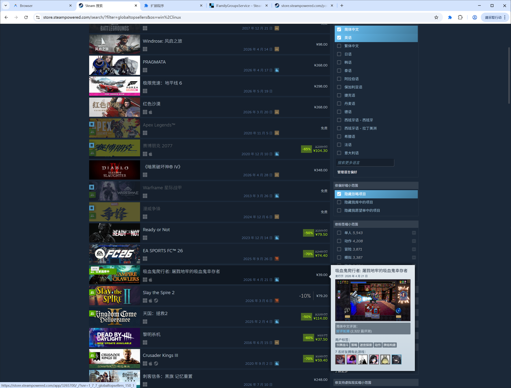

# Steam 家庭库指示器 (Steam Family Library Indicator)

这是一个 Chrome/Edge 浏览器扩展，旨在帮助 Steam 用户在浏览商店页面时，直观地识别出哪些游戏已经在自己的 **Steam 家庭共享库** 中。

## 🖼️ 效果预览 (Preview)

### 插件设置与获取

### 搜索结果标识

## ✨ 主要功能

*   **搜索页标识**：在 Steam 搜索结果页面的游戏封面左侧添加绿色“家庭库”标记。
*   **灵动交互**：标记默认仅显示图标，当鼠标悬停在标记或整行游戏条目上时，平滑展开显示“在家庭库中”文字。
*   **智能对齐**：自动避让 Steam 官方的“在库中”、“在愿望单中”等标记，防止 UI 重叠。
*   **详情页提醒**：在游戏详情页显眼位置展示该游戏属于家庭共享库的提醒。
*   **自动检测**：自动识别当前登录的 Steam ID，无需手动配置。

## 🚀 安装方法

### 开发者模式安装 (本地)
1.  下载本项目代码并解压。
2.  打开 Chrome 或 Edge 浏览器，进入 `扩展程序` 页面 (`chrome://extensions`)。
3.  开启右上角的 **“开发者模式”**。
4.  点击 **“加载解压的扩展程序”**，选择本项目所在的文件夹。

## ⚙️ 配置说明

由于 Steam API 的安全限制，获取家庭组数据需要使用 **Access Token**（OAuth 令牌）：

1.  在浏览器中登录 Steam 商店。
2.  访问以下链接获取令牌：
    [https://store.steampowered.com/pointssummary/ajaxgetasyncconfig](https://store.steampowered.com/pointssummary/ajaxgetasyncconfig)
3.  在返回的 JSON 页面中找到 `"webapi_token"` 的值（通常以 `v0` 开头）。
4.  点击插件图标，在设置界面粘贴该 Token 并点击 **“保存”**。
5.  点击 **“📡 获取家庭库”** 按钮即可完成数据同步。

## 🛠️ 技术细节

*   使用 **Manifest V3** 标准开发。
*   核心接口参考自 [SteamDB WebAPI Documentation](https://steamapi.xpaw.me/)。
*   使用 `IFamilyGroupsService` 接口获取最新的 Steam 家庭组共享应用列表。

## 📜 隐私声明

本项目仅在本地运行，您的 Access Token 和 Steam ID 仅存储在浏览器的本地存储 (`chrome.storage.local`) 中，绝不会上传到任何第三方服务器。

---

**如果您觉得好用，欢迎在 GitHub 上点一个 Star！🌟**
